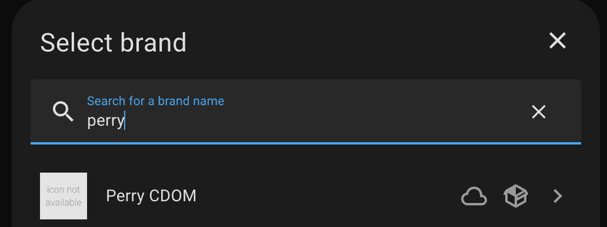
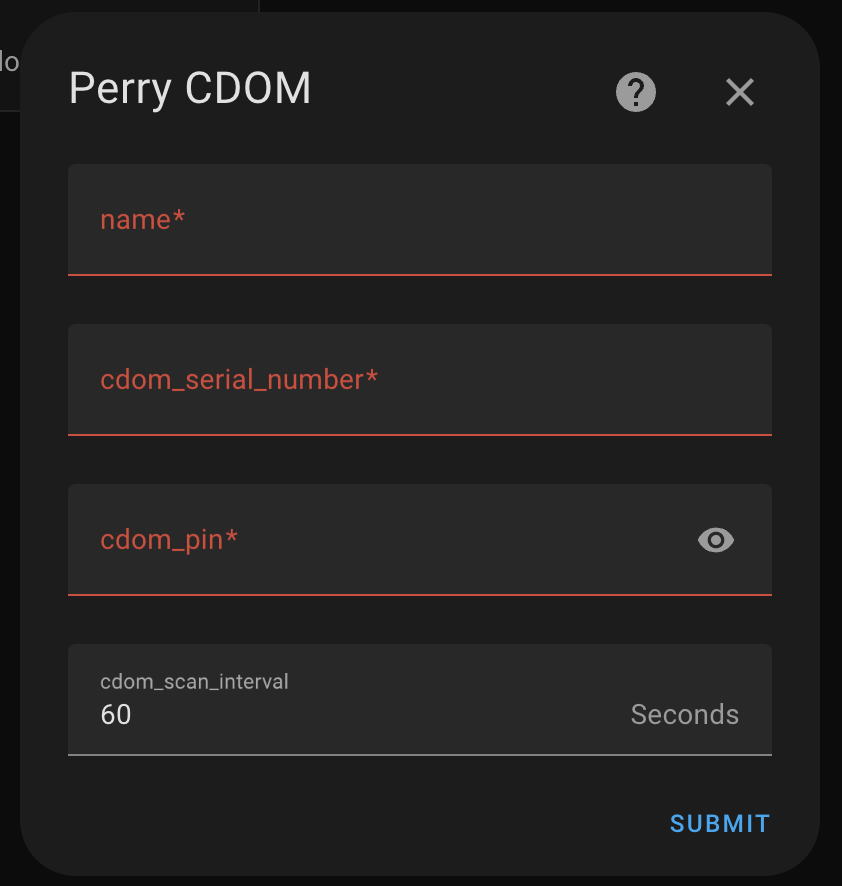

# Perry Electric CDOM for Home Assistant

[![GitHub Release][releases-shield]][releases]
[![License][license-shield]](LICENSE)
[![hacs][hacsbadge]][hacs]
[![Project Maintenance][maintenance-shield]][user_profile]

A custom component designed for Home Assistant with the capability to interact with the Perry Electric Thermostat C.DOM/CRM 4.0.

## Disclaimer :warning:

This project is unofficial and is not affiliated with, endorsed by, or supported by Perry Electric, Use this library and integration at your own risk. I am not responsible for any damages, malfunctions, or issues that may arise from using this software with your thermostat or any other device.

This project is unofficial and not affiliated with, endorsed by, or supported by Perry Electric. It is a personal initiative created to facilitate interaction with Perry Electric thermostats through a Python library and Home Assistant integration.

### Important Notice :warning:

Users assume all responsibility and legal liability for using this software. This library is intended to provide convenient access to thermostat controls for developers and hobbyists. It is not an official Perry Electric package, and excessive or commercial usage may lead to restrictions on your device or account.

Please note that using this software may involve risks, including possible malfunctions or compatibility issues with future updates by Perry Electric. Use at your own risk.

## Current Status

### What is working

#### Thermostat
- Read thermostat data
- Shows heating or idle depending on the status of the valves
- Support for HVAC_MODES OFF and AUTO
- Support for BOOST and AWAY preset
  - BOOST preset sets the manual temperature to 30 until midnight
  - AWAY preset turns off the thermoregulator
- Power on and off of the thermoregulator

#### Valves
- Read data from Valves
- Support for HVAC_MODES OFF and AUTO
- Support for setting the manual temperature until midnight

### What's not working
- Change of season
- Support to change temeperature for indefinite time.
- Ability to configure zones schedule and zone temperature T1, T2 and T3

## Installation

### Manual Installation
Using the tool of choice open the directory (folder) for your HA configuration (where you find configuration.yaml).

If you do not have a custom_components directory (folder) there, you need to create it.

In the custom_components directory (folder) create a new folder called perry_cdom.

Download all the files from the custom_components/perry_cdom/ directory (folder) in this repository.

Place the files you downloaded in the Home Assistant config directory in custom_components/perry_cdom/.

Restart Home Assistant

### Configuration
In the HA UI go to "Configuration" -> "Integrations" click "+" and search for "Perry CDOM"

Configure the integration using the following parameters

[hacs]: https://hacs.xyz
[hacsbadge]: https://img.shields.io/badge/HACS-Default-orange.svg
[license-shield]: https://img.shields.io/github/license/ivancoppa/homeassistant-perry-cdom.svg
[maintenance-shield]: https://img.shields.io/badge/maintainer-%40ivancoppa.svg
[releases-shield]: https://img.shields.io/github/release/ivancoppa/homeassistant-perry-cdom.svg
[releases]: https://github.com/ivancoppa/homeassistant-perry-cdom/releases
[user_profile]: https://github.com/ivancoppa
